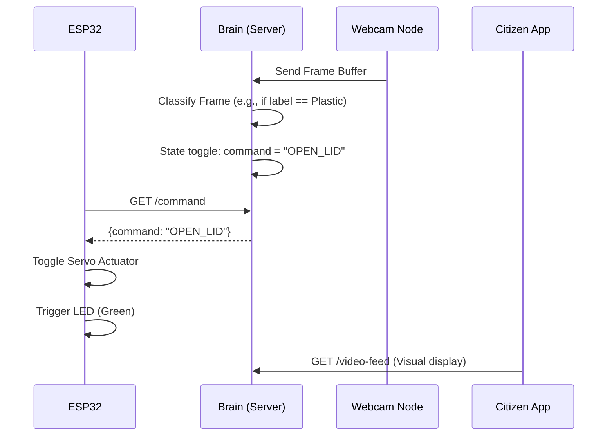

# EcoNode System Architecture - Overview

## 🧠 Concept: "Split-Brain" Architecture

EcoNode balances resource constraints (BOM ~ ₹1,800) and AI/UI capabilities using a distributed node approach:

1. **Edge Node (ESP32)**:
   - **Role**: Dedicated hardware controller (reliable, low-latency actuation).
   - **Responsibility**: Poll/Ingest sensor data (PMS5003, BME280), control Servo lid position, flash LED states.
   - **Scale**: One per waste bin location.

2. **Brain (Laptop/Local Server)**:
   - **Role**: Standard compute node (handles AI inference, frames streaming).
   - **Responsibility**: Run OpenCV classification (waste scoring), process sensor calibrations (FastAPI), host Dashboard endpoints.
   - **Scale**: One managing adjacent edge nodes securely.

3. **Frontend (Dashboard Clients)**:
   - **Role**: Presentation client (React).
   - **Responsibility**: Data visualizations for administration (MCD Dashboard) and user actuation (Citizen App).

---

## 📊 Component Diagram

```mermaid
graph TD
    ESP32[Edge Node: ESP32]
    Cam[Webcam Feed]
    FastAPI[Brain: FastAPI Server]
    React[Client: React Dashboard]

    ESP32 -->|POST /ingest-sensor| FastAPI
    Cam -->|Frame stream| FastAPI
    React -->|GET /video-feed| FastAPI
    React -->|GET /policy-alert| FastAPI
    ESP32 -->|GET /command (Poll)| FastAPI
```

---

## 🔄 Data Flow: Waste Actuation

Below describes the trigger flow for opening the segregation lid automatically:



---

## 🔒 Security & Constraints
- **Communication**: Local standard HTTP polling (FastAPI `<->` Edge). No Auth added yet for simple MVP prototyping.
- **Constraints**: Actuation relies on Edge ESP32 having constant polling cycles connected via local WiFi mesh.

---
*Created using @architecture Guidelines*
